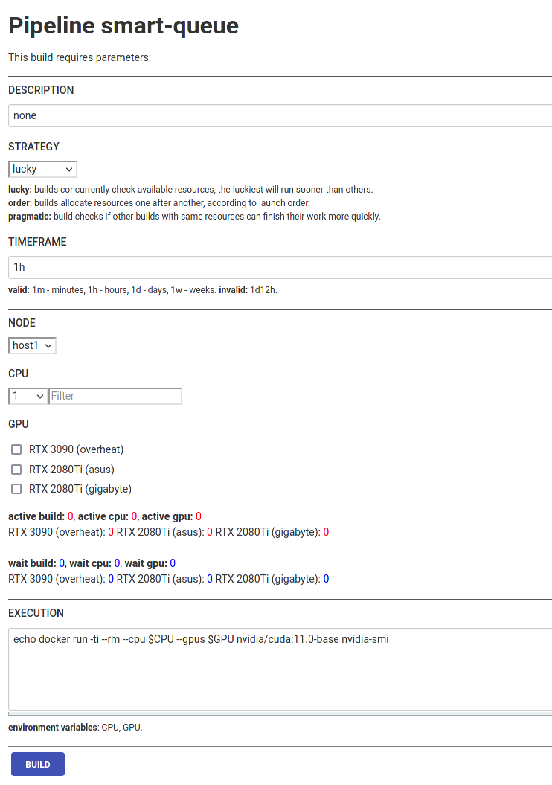

## Project is intended for running builds inside custom queues and share arbitrary resources.



### Requirements:

1. Linux
2. Docker

### Quick start:

1. Pull repo.
```shell script
git clone https://github.com/livelace/jenkins-showcase.git
```

2. Edit **node.yaml** and set appropriate options. 
```shell script
cd jenkins-showcase/showcase/smart-queue/config
vi node.yaml
```

3. Generate SSH keys, add public key to target hosts.
```shell script
ssh-keygen -t rsa -m PEM -N "" -C "smart-queue" -f secret.key
```

4. Bootstrap.

```shell script
cd ..
./bootstrap.sh
```

5. Login into [http://127.0.0.1:8080](http://127.0.0.1:8080) with **admin:admin** and run build (first build will be aborted automatically for init purpose).